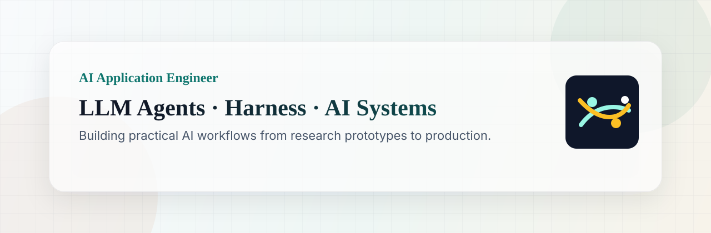
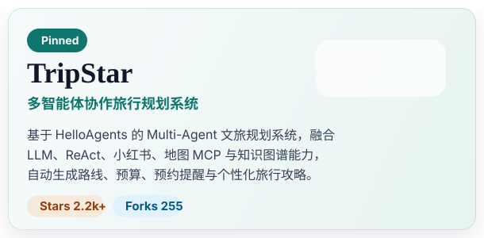
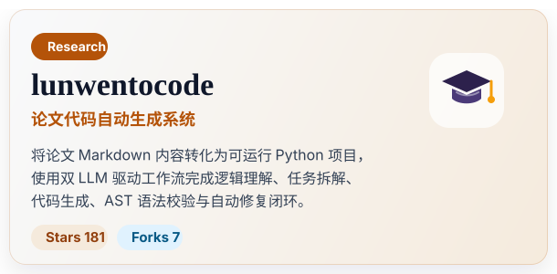

  

## Featured Projects

<table>
  <tr>
    <td width="50%" valign="top" align="center">
      
    </td>
    <td width="50%" valign="top" align="center">
      
    </td>
  </tr>
</table>

## Experience Highlights

**Alibaba · AI 应用工程师实习生** `2026.06 - 2026.08`

**重庆第纬科技有限公司 · NLP 智能体算法实习生** `2025.12 - 2026.03`

持续关注 AI 的发展，我的关注方向重点涵盖四个维度：一是 LLM Agent 工程化，包括 Multi-Agent 协作、ReAct 模式、Function Calling 及容错恢复机制，并以 Loop Engineer 的视角构建智能体的持续迭代与反馈闭环；二是 RAG 与知识增强，聚焦混合检索、重排序、多跳召回及基于 Harness 的可观测评测与管控；三是 AI 应用落地，探索 AI Native 需求分析、智能办公与出行规划等场景；四是工程效率提升，善用 Git 工作流、Skill 迭代及 Codex/Claude Code 辅助开发，搭建高效的开发 Harness。也在期待与大家围绕 LLM 应用落地、智能体工程化及 AI Coding 展开交流。

## Contact

- GitHub: [github.com/1sdv](https://github.com/1sdv)
- Email: [lcc112220@163.com](mailto:lcc112220@163.com)

